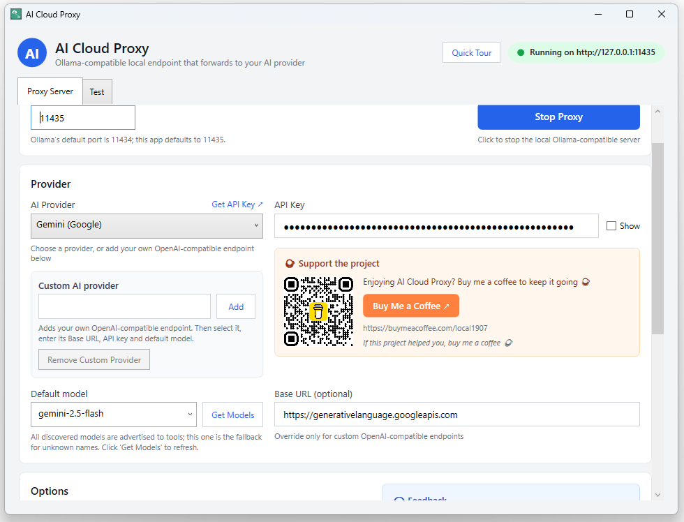
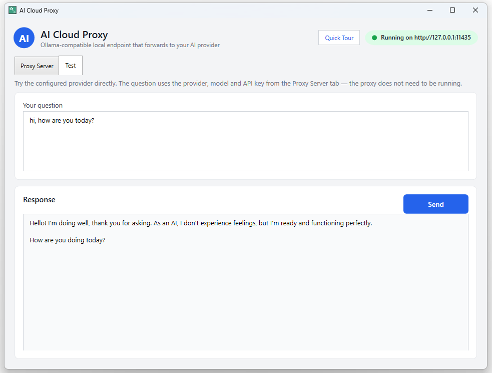
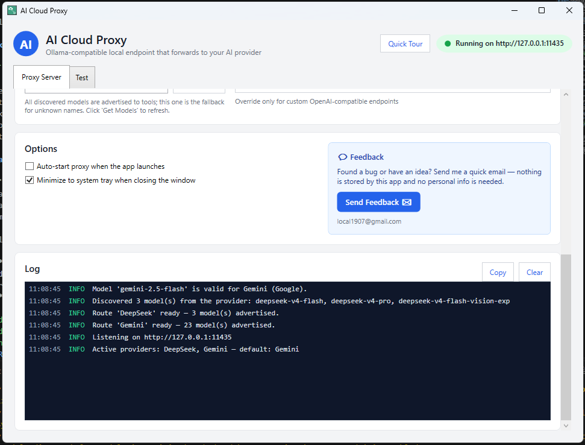
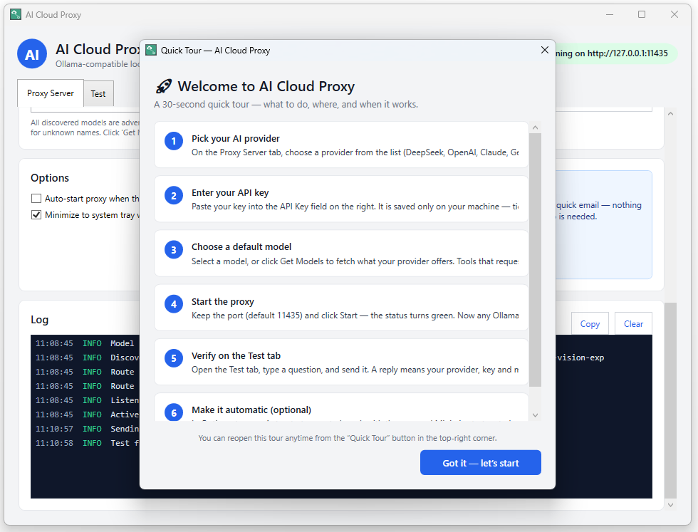

# AI Cloud Proxy (AICloudProxy.exe)

<p align="center">
  
  
  
  
</p>

A Windows desktop app (C# / .NET 10 / WPF) that exposes an **Ollama-compatible HTTP endpoint**
on your machine and forwards every request to a cloud AI provider (**DeepSeek**, **OpenAI**,
**Gemini**, or **Claude**). Tools that normally talk to Ollama (VS Code extensions, Continue,
Cline, etc.) can be pointed at `http://127.0.0.1:<port>` and will work against your chosen
cloud provider — no local model downloads needed.

> 🔒 **Your API keys never leave your machine.** Keys are stored only in
> `%APPDATA%\AiCloudProxy\settings.json` and are never committed to this repository.

## Screenshots


*Main window — pick a provider (Gemini shown), paste your API key, and Start the proxy.*


*Test tab — stream a live answer directly from the selected provider.*


*Options, feedback and the live log — active providers at a glance.*


*Quick Tour — a 30-second guided setup shown on first launch.*

> Screenshots live in `web/assets/screenshots/` and are shared with the
> [AICloudProxy.com marketing site](web/).

## Features

- **Desktop GUI** — enter your API key, set the port, choose a provider, Start/Stop the proxy, and watch a live log.
- **System tray** — keeps running silently next to the clock; reopen or exit from the tray icon.
- **In-process HTTP listener** — a lightweight ASP.NET Core service hosted inside the app:
  - `POST /api/chat` — Ollama chat format (NDJSON streaming)
  - `POST /api/generate` — Ollama generate format (NDJSON streaming)
  - `POST /api/show`, `GET /api/show` — per-model metadata + capabilities (required by Visual Studio 2026 Copilot BYOM)
  - `POST /v1/chat/completions` — OpenAI format (SSE streaming)
  - `GET /api/tags` — advertises all discovered models (with capabilities & token limits) so tools can discover them
  - `GET /v1/models` — OpenAI-compatible model list
- **Configurable port** and **configurable API key**.
- **Per-provider settings** — every AI provider keeps its own API key, base URL and last model; switching providers restores them automatically.
- **Custom AI provider** — add your own OpenAI-compatible endpoint (name + base URL + key + model) and it appears in the provider dropdown.
- **Test tab** — ask a question and stream the answer directly from the selected provider.
- **Copyable log** — "Copy" puts all log lines on the clipboard (the proxy log is otherwise read-only).
- **Model auto-discovery** — "Get Models" fetches the provider's live model list; on Start the configured model is validated against it and you're warned (switch / continue / cancel) if it no longer exists.
- **Multi-provider routing** — every provider with a saved API key is **active at the same time**. `GET /api/tags` advertises all their models with qualified `model@Provider` names (e.g. `deepseek-v4-flash@DeepSeek`, `gemini-2.5-flash@Gemini`); each request routes to the provider that owns the requested model, and unknown names fall back to the currently selected provider. Use the qualified name when the same model exists on more than one provider.
- **API key links** — "Get API Key ↗" opens the right key page for the selected provider.
- Settings persist to `%APPDATA%\AiCloudProxy\settings.json`.

## How it works

```
Your tool (Ollama client)
      │  POST http://127.0.0.1:11435/api/chat   (Ollama wire format)
      ▼
 AICloudProxy.exe  ── in-process listener ── translates ──►  Provider API
      │                                               (DeepSeek / OpenAI / Gemini / Claude)
      └────────  Ollama-format stream back  ◄────────┘
```

The app translates between the Ollama wire format and each provider's native format:

| Provider | Model (default, editable) | Format translated |
|----------|---------------------------|-------------------|
| DeepSeek | `deepseek-v4-flash`        | OpenAI-compatible |
| OpenAI   | `gpt-4o-mini`             | OpenAI-compatible |
| Gemini   | `gemini-2.5-flash`        | `generateContent` |
| Claude   | `claude-sonnet-4-5-20250929` | Anthropic Messages |
| Custom   | (yours)                   | OpenAI-compatible |

> **Custom providers:** any OpenAI-compatible endpoint works (OpenRouter, vLLM, LM Studio, …).
> When you add one, put the **full API path** in the Base URL field — e.g. `https://openrouter.ai/api/v1`,
> not just `https://openrouter.ai` — because the app appends `/chat/completions` and `/models` to it.

> **Gemini note (2026):** Google now rejects old **"Standard"/unrestricted** API keys
> with `401/403`. Create a fresh key at https://aistudio.google.com/apikey — all new
> keys are "auth" keys — and paste it into the app. AI Cloud Proxy also sends the key via the
> `X-Goog-Api-Key` header (Google's recommended method).

DeepSeek also exposes `deepseek-v4-pro` and the experimental `deepseek-v4-flash-vision-exp`
(image input). Instead of typing these by hand, enter your API key and click **Get Models**
in the app — it queries the provider and fills the model dropdown automatically.

## Build & run (dev)

```powershell
dotnet build src/AiCloudProxy/AiCloudProxy.csproj
dotnet run --project src/AiCloudProxy/AiCloudProxy.csproj
```

The executable is produced at `src/AiCloudProxy/bin/Debug/net10.0-windows/AICloudProxy.exe`.

## Publish a single-file exe

Requires the Windows 10/11 SDK (for a WPF single-file build) and the matching runtime on target machines.

```powershell
# Framework-dependent, single file (needs .NET Desktop Runtime 10 on the target PC):
dotnet publish src/AiCloudProxy/AiCloudProxy.csproj -c Release -r win-x64 --self-contained false -p:PublishSingleFile=true -p:IncludeNativeLibrariesForSelfExtract=true

# Fully self-contained single file (no runtime needed, larger exe):
dotnet publish src/AiCloudProxy/AiCloudProxy.csproj -c Release -r win-x64 --self-contained true -p:PublishSingleFile=true -p:IncludeNativeLibrariesForSelfExtract=true
```

Output lands in `src/AiCloudProxy/bin/Release/net10.0-windows/win-x64/publish/AICloudProxy.exe`.

## Quick start

1. Run `AICloudProxy.exe`.
2. Pick a provider (e.g. DeepSeek) and click **Get API Key ↗** to grab a key from that provider's site.
3. Paste the API key into the **API Key** box.
4. Set the **Port** (default `11435`).
5. Click **Start Proxy**.
6. In your tool that normally talks to Ollama, set the base URL to `http://127.0.0.1:11435` (or your chosen port).
7. Use the **Test** tab to send a sample question and verify everything works.

## Visual Studio 2026 Copilot (BYOM / Bring Your Own Model)

VS 2026's Copilot Chat can use AI Cloud Proxy through its **Ollama** provider. It needs the
model capabilities that AI Cloud Proxy now advertises via `POST /api/show` and `GET /api/tags`
(tool calling + token limits) — without them models get listed but never appear
in the model picker.

1. Enable **Bring Your Own Key**: `Tools → Options → search "Enable bring" →`
   tick **"Bring Your Own Key managed models endpoint"**.
2. In **Copilot Chat**, open the model picker → **Manage models / Add a model** →
   **Add model provider** → choose **Ollama**.
3. Enter the AI Cloud Proxy URL: `http://127.0.0.1:11435` (or your port).
4. Use **Agent (Preview)** mode and select one of the discovered models.

> If models still don't show up after an update, remove and **re-add** the Ollama
> provider (VS 18.10 Insiders dropped previously added Ollama models across a
> backend update). As a manual fallback you can edit
> `%USERPROFILE%\AppData\Local\Microsoft\VisualStudio\Copilot\BringYourOwnModel\ConfiguredBringYourOwnModel_v2.json`
> and set `"IsToolCallingEnabled": true` for your models.

## License

MIT License

Copyright (c) 2026 AI Cloud Proxy contributors

Permission is hereby granted, free of charge, to any person obtaining a copy
of this software and associated documentation files (the "Software"), to deal
in the Software without restriction, including without limitation the rights
to use, copy, modify, merge, publish, distribute, sublicense, and/or sell
copies of the Software, and to permit persons to whom the Software is
furnished to do so, subject to the following conditions:

The above copyright notice and this permission notice shall be included in all
copies or substantial portions of the Software.

THE SOFTWARE IS PROVIDED "AS IS", WITHOUT WARRANTY OF ANY KIND, EXPRESS OR
IMPLIED, INCLUDING BUT NOT LIMITED TO THE WARRANTIES OF MERCHANTABILITY,
FITNESS FOR A PARTICULAR PURPOSE AND NONINFRINGEMENT. IN NO EVENT SHALL THE
AUTHORS OR COPYRIGHT HOLDERS BE LIABLE FOR ANY CLAIM, DAMAGES OR OTHER
LIABILITY, WHETHER IN AN ACTION OF CONTRACT, TORT OR OTHERWISE, ARISING FROM,
OUT OF OR IN CONNECTION WITH THE SOFTWARE OR THE USE OR OTHER DEALINGS IN THE
SOFTWARE.
